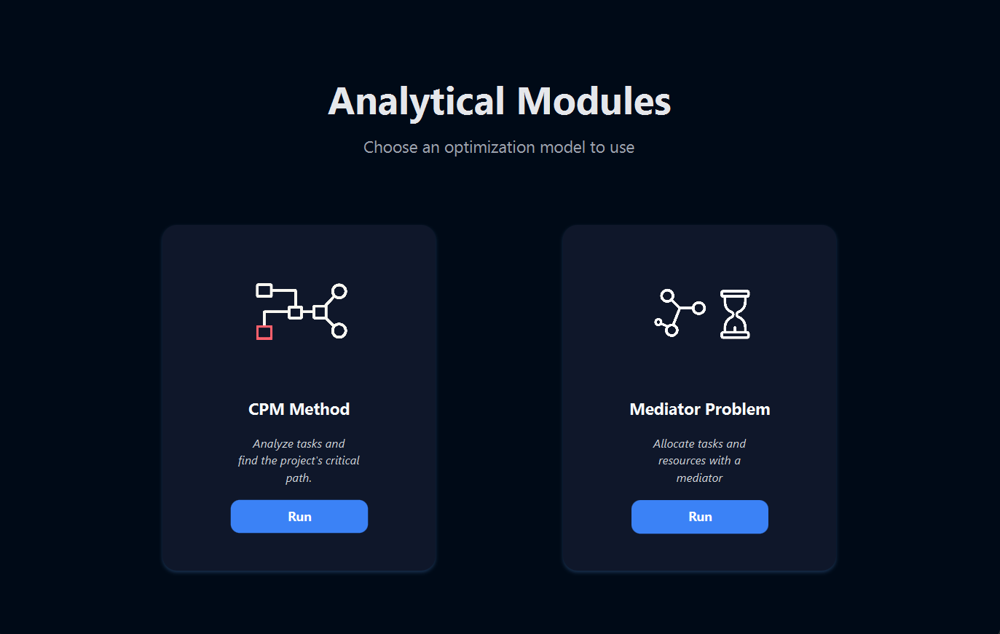
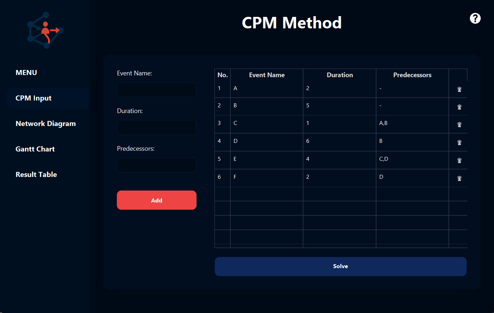
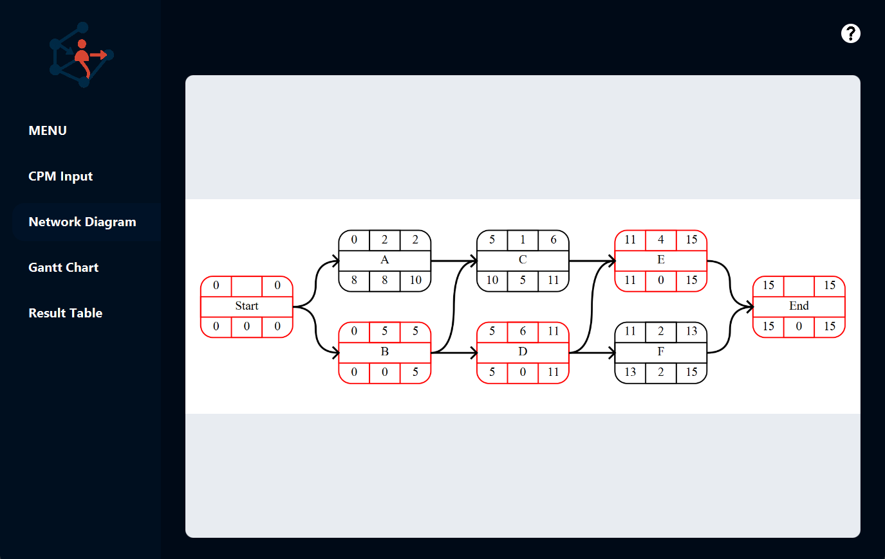
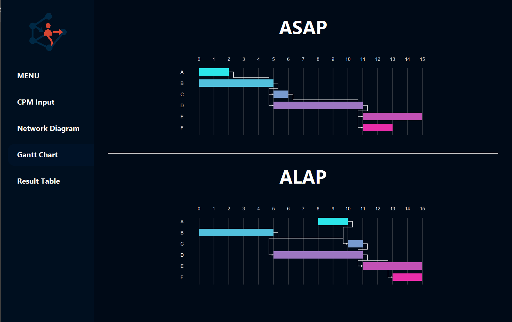
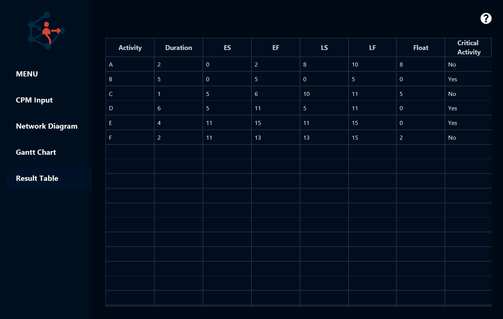
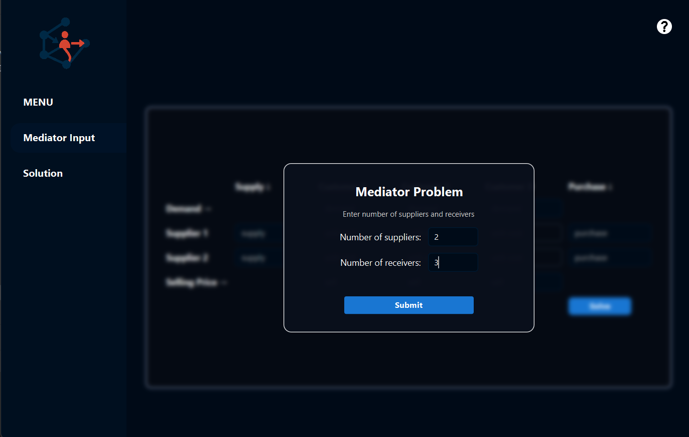
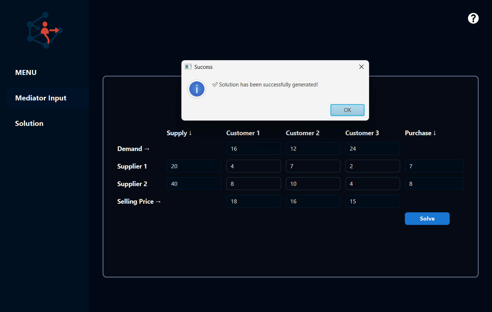
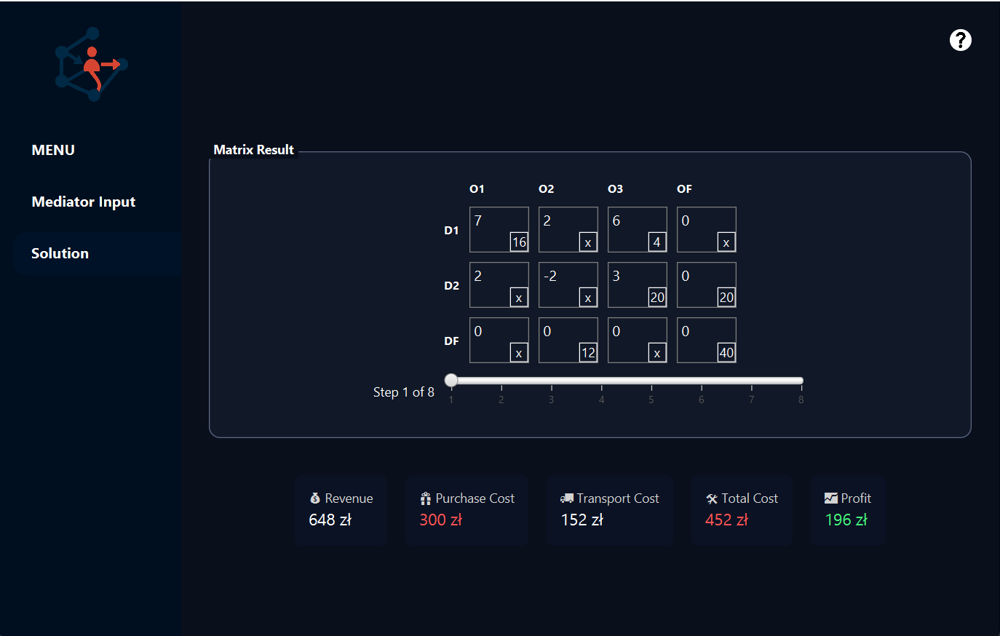

# Logistics – JavaFX Frontend Application

**Logistics** is a JavaFX-based desktop frontend that supports decision-making in logistics through two main modules:

1. **Critical Path Method (CPM)**
2. **Mediator Problem (Transport Problem)**

## Features

### 1. Critical Path Method (CPM)

- Users input activity data, including predecessor relationships, through a simple form.
- The application sends the input to the backend and retrieves a computed solution.
- Results are displayed in:
  - A Gantt chart
  - A dependency diagram
  - A summary table with calculated values

### 2. Mediator Problem (Transport Optimization)

- Users are prompted to enter the number of **suppliers** and **customers**.
- Based on this, the application **dynamically generates a matrix input form**.
- After filling in demand, supply, unit costs, purchase and selling prices:
  - A solution is computed and displayed in the **"Solution"** tab.
  - The result includes the optimal transport plan and a **step-by-step history** of the calculation process.
    

## Project Structure

- `controllers/` – JavaFX controllers for handling UI logic
- `fxml/` – FXML layouts for the application views
- `icons/` – Image resources (e.g., logo, help icon)

##  Requirements

- JDK 17 or newer
- Internet connection (for backend communication)
- JavaFX SDK (if running outside of an IDE)

