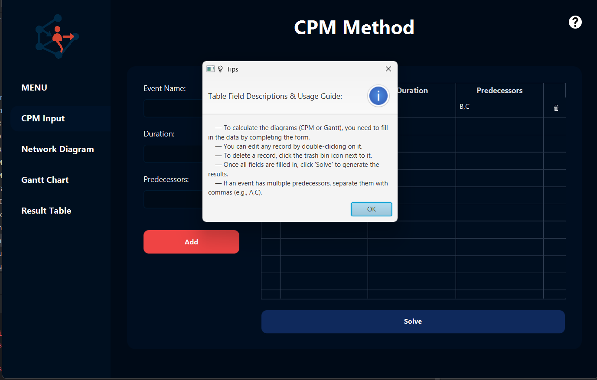

# Frontend 

Założyłam, że będzie okno startowe, gdzie będą dwie ściezki do wyboru: Metoda CPM, oraz Zagadnienie Pośrednika(nie działa, póki co XD). 
Po wejsciu na Metode CPM. Automatycznie wrzuca użytkownika na widok gdzie ma formularz i tabele. 
Użytkownik może:
- dodawać dane
- usuwać dane
- edytować dane
- ma też po lewej górnej stronie tipa, jak naciśnie w ikone, z wytłumaczeniem ogólnym.

Założyłam że użytkownik będzie dodawał, edytował dane, aż uzna że wszystko mu się podoba i klika w przycisk "Solve".
Przycisk ten:
- zbiera dane, które użytkownik wpisał do tabeli i przygotowuje do wysłania do backendu w nastepującej postaci:
```
{
  "tasks": {
    "A": {
      "duration": 2,
      "previous": []
    },
    "B": {
      "duration": 3,
      "previous": ["A"]
    },
    "C": {
      "duration": 5,
      "previous": ["A"]
    },
    "D": {
      "duration": 4,
      "previous": ["B", "C"]
    }
  }
}
```
- Następnie oczekuje od backendu 2x pliki svg oraz dane do tabeli(ES, EF etc.)
- Użytkownik dostaje powiadomienie że wszystko poszło pomyślnie i może zacząć analize wyników

Dodałam dla użytkownika ostrzeżenia:
- nie może podać w duration nic innego niż dane liczbowe
- musi uzupełnić każde pole, jeśli nie ma poprzednika to użytkownik daje "-"

Oraz Legendy/Tipy:
- w scenach Metoda CPM, Diagram, oraz Tabela


Narazie to działa przykładowych tam danych.





